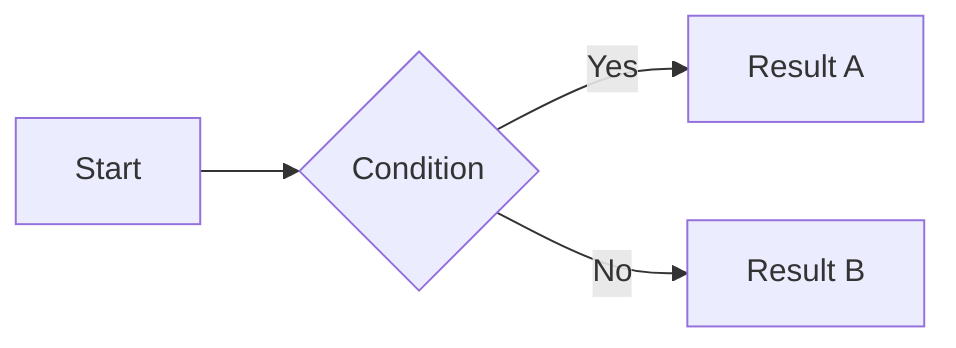

# [Product Name] — PRD

## 1. Product Overview

### 1.1 Product Name
[Name]

### 1.2 Problem Statement
> [Who] in [what situation] struggles with [what problem]. They currently use [workaround] but face [limitation].

### 1.3 Product Vision
[2-3 sentences. Why this product exists and what it aspires to be.]

### 1.4 Target User
- **Primary**: [Primary Persona name] — [one-line description]
- **Secondary**: [Secondary Persona name] — [one-line description]

---

## 2. Goals & Success Metrics

### 2.1 Business Goals
| # | Goal | KPI | Baseline | Target | Measurement |
|---|------|-----|----------|--------|-------------|
| BG-1 | | | | | |
| BG-2 | | | | | |
| BG-3 | | | | | |

### 2.2 User Goals
| # | Goal | KPI | Baseline | Target | Measurement |
|---|------|-----|----------|--------|-------------|
| UG-1 | | | | | |
| UG-2 | | | | | |
| UG-3 | | | | | |

---

## 3. Feature Requirements

### 3.1 Must Have (MVP)

#### F-001: [Feature Name]
- **User Story**: As a [persona], I want to [action] so that [benefit].
- **Acceptance Criteria**:
  1. **Given** [precondition], **When** [action], **Then** [expected result]
  2. **Given** [precondition], **When** [action], **Then** [expected result]
  3. **Given** [precondition], **When** [action], **Then** [expected result]
- **Edge Cases**:
  - [Edge case 1 — scenario + expected behavior]
  - [Edge case 2 — scenario + expected behavior]

#### F-002: [Feature Name]
[Repeat format above]

### 3.2 Should Have
| ID | Feature | User Story (brief) | Priority Rationale |
|----|---------|--------------------|--------------------|
| F-010 | | | |

### 3.3 Could Have
| ID | Feature | Description | Future Consideration |
|----|---------|-------------|---------------------|
| F-020 | | | |

### 3.4 Won't Have (Explicit Exclusions)
| Feature | Exclusion Reason |
|---------|-----------------|
| | |

---

## 4. User Flows

### 4.1 Core Flow: [Flow Name]

### 4.2 [Additional Flow Name]
[Mermaid diagram]

---

## 5. Non-Functional Requirements

### 5.1 Performance
- Page load: [target time]
- API response: [target time]

### 5.2 Accessibility
- WCAG [level] compliance
- [Specific requirements]

### 5.3 Security
- [Auth/authorization requirements]
- [Data protection requirements]

### 5.4 Supported Platforms
- [Device/browser scope]

---

## 6. Technical Constraints & Assumptions
| Type | Description | Status |
|------|-------------|--------|
| Constraint | | Confirmed |
| Assumption | | Needs Validation |

---

## 7. Out of Scope
| Item | Reason |
|------|--------|
| | |

---

## 8. Open Questions
| # | Question | Owner | Due Date | Decision |
|---|----------|-------|----------|----------|
| Q-1 | | | | Pending |
